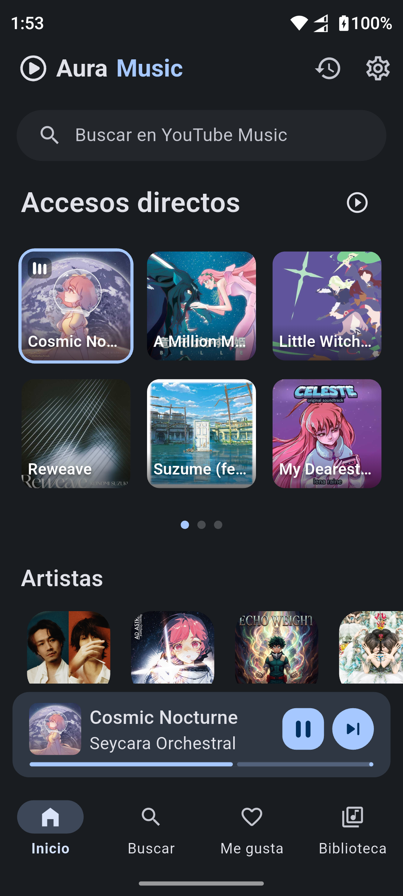
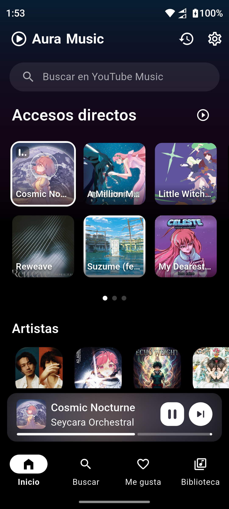
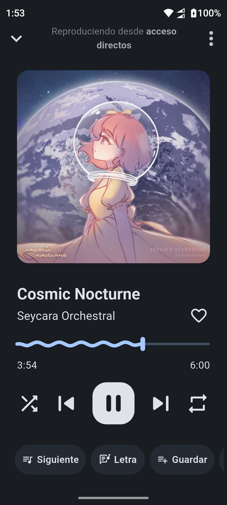
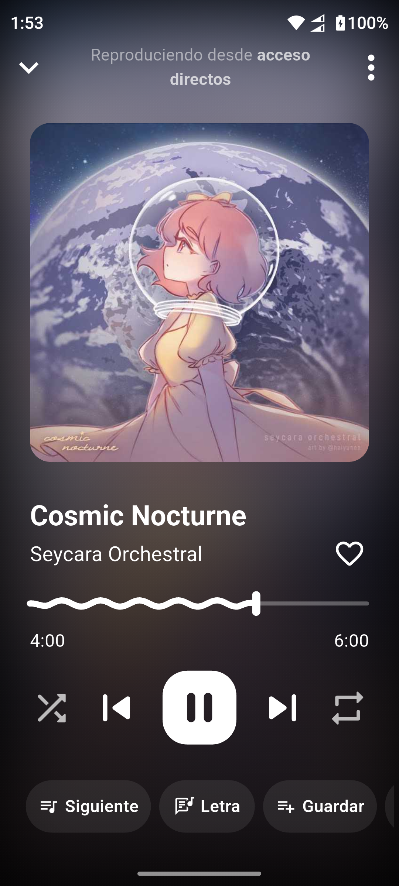
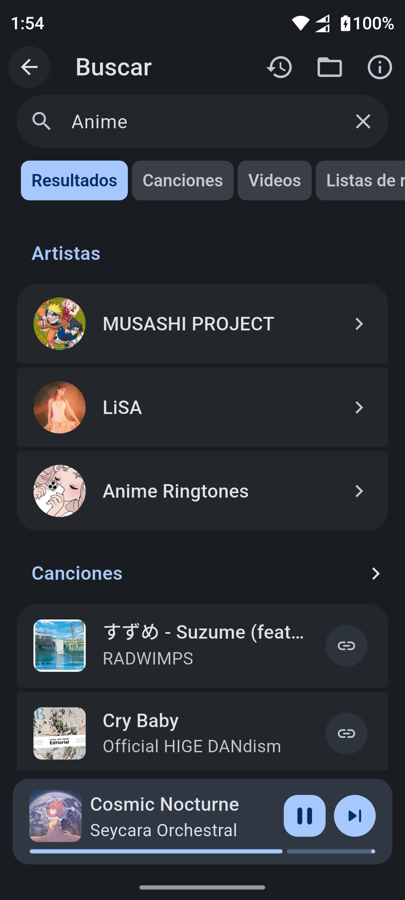
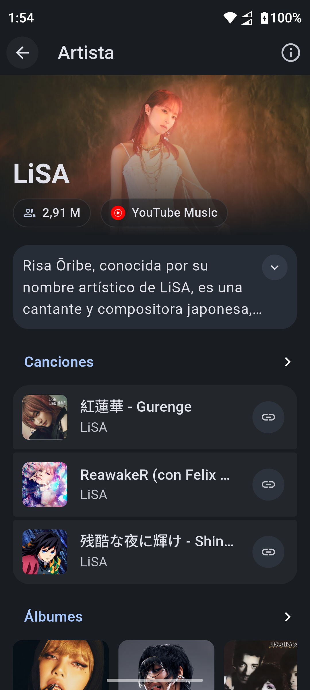
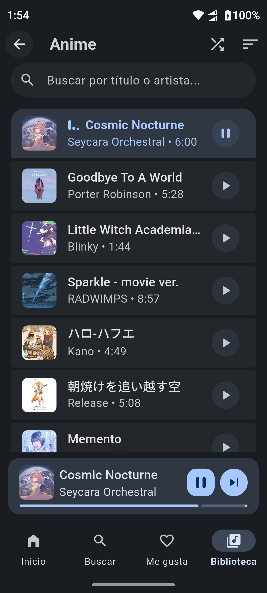
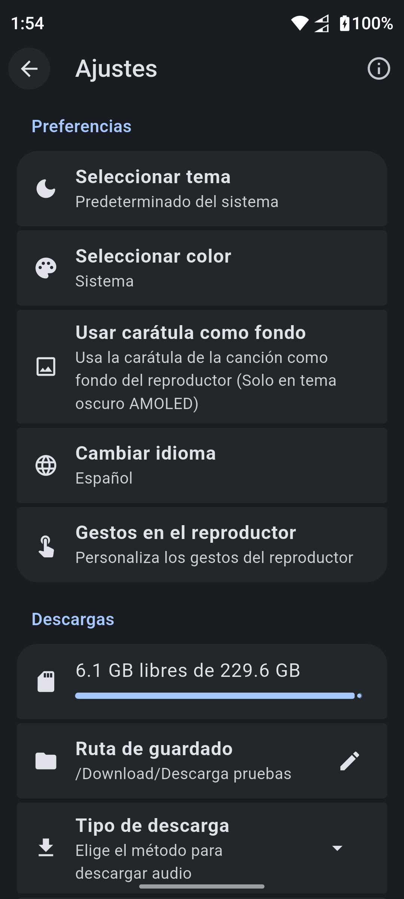

<p align="center">
  
</p>

# Aura Music

**Aura Music** es una aplicación de música para Android desarrollada con Flutter. Permite reproducir canciones vía streaming y archivos locales, descargar canciones desde YouTube con carátula y metadatos, y disfrutar de una interfaz moderna.

## Capturas de pantalla

<p float="left">
  
  
  
  
</p>

<p float="left">
  
  
  
  
</p>

## Características
- **Música vía streaming**: Reproducción directa desde YouTube Music.
- **Reproductor completo**: con notificación, lockscreen y soporte para controles de auriculares.
- **Descarga desde YouTube**: Descarga canciones usando `youtube_explode_dart` + `AudioTags`.
- **Carátulas automáticas**: descarga y embebe la portada en el archivo.
- **Exploración por carpetas**: detecta solo directorios que contienen música.
- **Control multimedia total**: desde la app o el sistema.
- **Interfaz intuitiva**: diseño limpio y rendimiento optimizado.

## Tecnologías usadas

- [`Flutter`](https://flutter.dev/)
- [`just_audio`](https://pub.dev/packages/just_audio)
- [`audio_service`](https://pub.dev/packages/audio_service)
- [`youtube_explode_dart`](https://pub.dev/packages/youtube_explode_dart)
- [`audiotags`](https://pub.dev/packages/audiotags)
- [`path_provider`](https://pub.dev/packages/path_provider)
- [`permission_handler`](https://pub.dev/packages/permission_handler)

# Licencia
```
Aura Music es software libre con licencia GPL v3.0 con las siguientes condiciones.

- Las versiones copiadas o modificadas de este software no pueden utilizarse con fines no libres ni con lucro.
- No puedes publicar una versión copiada o modificada de esta aplicación en repositorios de aplicaciones de código cerrado
  como Play Store o App Store.

```

# Descargo de responsabilidad
```
Este proyecto fue creado con fines de aprendizaje; ese es su propósito principal.
Este proyecto no está patrocinado, afiliado, financiado, autorizado ni respaldado por ningún proveedor de contenido.
Cualquier canción, contenido o marca registrada usada en esta aplicación es propiedad intelectual de sus respectivos titulares.
Aura Music no se hace responsable de ninguna infracción de derechos de autor u otros derechos de propiedad intelectual que pueda derivarse
del uso de las canciones u otros contenidos disponibles a través de esta aplicación.

Este software se distribuye "tal cual", sin ninguna garantía, responsabilidad u obligación.
En ningún caso el autor de este software será responsable por daños especiales, consecuentes,
incidentales o indirectos de cualquier tipo (incluyendo, sin limitación, cualquier
pérdida pecuniaria) que surjan del uso o la imposibilidad de usar este producto, aun cuando
el autor del software conozca la posibilidad de tales daños o defectos conocidos.
```

# Referencias de aprendizaje y créditos
<a href = 'https://docs.flutter.dev/'>Documentación de Flutter</a> - una guía excelente para aprender desarrollo de interfaces y aplicaciones multiplataforma<br/>
<a href = 'https://github.com/sigma67'>sigma67</a> - proyecto no oficial de API de ytmusic
- <a href = 'https://lrclib.net'>lrclib</a> - fuente utilizada para extraer letras de canciones (formato LRC).
- <a href = 'https://lyrics.simpmusic.org/'>lyrics.simpmusic.org</a> - proveedor de letras y metadatos de canciones usado para extracción.
